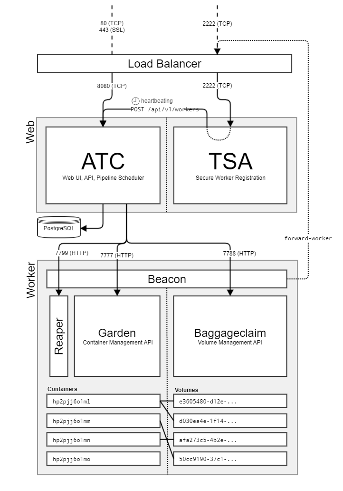

# Concourse CI Installation

## Overview

This project demonstrates the process of deploying a **Concourse CI/CD instance** in a home lab environment. The setup uses **Proxmox LXC containers** to isolate components and leverages **systemd** for process management instead of Docker. The deployment includes a dedicated PostgreSQL database, a Concourse Web node, and a Concourse Worker node.

### Concourse CI Architecture Diagram

<p align=center>

</p>

---

## Objectives

1. Provision LXC and VM in **Proxmox** for Concourse Web, Concourse Worker, and PostgreSQL nodes
2. Install and configure **PostgreSQL** for data storage
3. Install and deploy a **Web node** instance for GUI access
4. Install and deploy a **Worker node** to run the pipelines
5. Validate the CI/CD setup by running the initial Concourse CI test pipelines

---

## Hardware and Software Requirements

### Hardware

- Proxmox VE host
- At least **2 CPU** cores and **2GB RAM** per LXC Container/VM (Recommended)
- At least **10GB storage** for LXC root disks and PostgreSQL data

### Software

- **Proxmox VE** (current stable)
- **Ubuntu Server 24.04** LXC Template
- **PostgreSQL 15+**
- **Concourse CI** (latest release)
- (Optional) **Caddy/Nginx/Traefik** for TLS/reverse proxy

---

## Networking & Ports

- Concourse Web UI: **8080/tcp** (HTTP) - expose via reverse proxy/TLS for increased security
- TSA (worker SSH): **2222/tcp** - internal only
- PostgreSQL: **5432/tcp** - internal only

Recommended: place all LXCs on the same VLAN or bridge, allow only necessary internal connectivity, and restrict from WAN.

---

## Step 1: Provision LXC Containers in Proxmox

You can create containers with the Proxmox UI or the CLI, in our case, we use the CLI.

```bash
# PostgreSQL 
pct create 201 local:vztmpl/ubuntu-24.04-standard_24.04-1.amd64.tar.zst \
    --hostname postgres \
    --cores 2 --memory 4096 --swap 0 \
    --rootfs local-lvm:8 \
    --net0 name=eth0,bridge=vmbr0,ip=dhcp \
    --unprivileged 1 \
    --features keyctl=1,nesting=1

# Concourse Web Node
pct create 202 local:vztmpl/ubuntu-24.04-standard_24.04-1.amd64.tar.zst \
    --hostname concourse-web
    --cores 2 --memory 2048 --swap 0 \
    --rootfs local-lvm:8 \
    --net0 name=eth0,bridge=vmbr0,ip=dhcp \
    --unprivileged 1 \
    --features keyctl=1,nesting=1

# Concourse Worker Node
pct create 203 local:vztmpl/ubuntu-24.04-standard_24.04-1.amd64.tar.zst \
    --hostname concourse-worker
    --cores 2 --memory 2048 --swap 0 \
    --rootfs local-lvm:8 \
    --net0 name=eth0,bridge=vmbr0,ip=dhcp \
    --unprivileged 1 \
    --features keyctl=1,nesting=1
```

> **LXC notes for worker:** Concourse workers create containers using Garden/Baggageclaim as seen in the Concourse architecture diagram above. In LXC, enable `nesting=1` and `keyctl=1`. If you plan to use overlayfs, ensure the kernel/filesystem supports it (you may need to load `overlay` module on the host and use ext4/xfs on the worker rootfs).

After creating the containers, start them and update packages:

```bash
apt update && apt upgrade -y
```

## Step 2: Setting up the PostgreSQL (LXC: postgres)

Install and Configure PostgreSQL:

```bash
apt install -y postgresql postgresql-contrib
```

Create the Concourse database and user (replace the strong password with your own)

```bash
sudo -u postgres psql <<'SQL'
CREATE USER concourse WITH PASSWORD 'REPLACE_ME_STRONG_PASSWORD';
CREATE DATABASE concourse_db OWNER concourse;
GRANT ALL PRIVILEGES ON DATABASE concourse_db TO concourse;
SQL
```

Allow connections from the Concourse Web LXC (edit both files):

- `/etc/postgresql/*/main/postgresql.conf`

  ```conf
  listen_address = '*'
  ```

- `/etc/postgresql/*/main/pg_hba.conf`
  Add a line permitting the web LXC (adjust subnet and IP):
  
  ```conf
  host      concourse_db    concourse   10.0.0.0/24     scram-sha-256
  ```

Restart PostgreSQL:

```bash
systemctl restart postgresql
systemctl enable postgresql
```

## Step 3: Generating the necessary encryption keys

As per the [Concourse Docs](https://concourse-ci.org/concourse-generate-key.html) on key generation, there are 3 keys that are required for a minimal deployment (A PostgreSQL DB, A Web node, and a Worker node):

- **Session Signing Key**: Used by the web node for signing and verifying user session tokens.
- **TSA Host Key**: Used by the web node for the SSH worker registration gateway server ("TSA"). The public key is given to each worker node to verify the remote host when connecting via SSH.
- **Worker Key**: Each worker node verifies its registration with the web node via an SSH key. The public key **must** be listed in the web node's _authorized worker keys_ file in order for the worker to register

### Generating the keys

I recommend generating the keys on the web node for ease of access. In our case, we will be using `ssh-keygen` to generate all the necessary keys:

```bash
ssh-keygen -t rsa -b 4096 -m PEM -f ./session_signing_key
ssh-keygen -t rsa -b 4096 -m PEM -f ./tsa_host_key
ssh-keygen -t rsa -b 4096 -m PEM -f ./worker_key
```

Which will result in the following files:

- `session_signing_key`
- `tsa_host_key`
- `tsa_host_key.pub`
- `worker_key`
- `worker_key.pub`

(We do not need the `session_signing_key.pub` file)
> It is possible to have multiple worker nodes, however we will not cover how to generate and use those keys in this writeup. Detailed steps can be found in the [Concourse Docs](https://concourse-ci.org/concourse-generate-key.html) on keygen

## Step 4: Concourse Web Setup (LXC: concourse-web)

### 4.1 Install Concourse CLI

```bash
# Dependencies
apt install -y curl tar ca-certificates nano

# Download the latest (Make sure to change the CONCOURSE_VERSION variable to the proper version, found on the Concourse GitHub) 
CONCOURSE_VERSION="<select-a-concourse-version>"
CONCOURSE_TAR="concourse.tgz"
CONCOURSE_URL="https://github.com/concourse/concourse/releases/download/v${CONCOURSE_VERSION}/concourse-${CONCOURSE_VERSION}-linux-amd64.tgz"
curl -L --output ./${CONCOURSE_TAR} ${CONCOURSE_URL}
tar -xzf ./${CONCOURSE_TAR}
mv concourse /usr/local/bin/concourse
chmod +x /usr/local/bin/concourse
rm ./${CONCOURSE_TAR}
```

If you want to make it easier to use the Concourse CLI, add it to the PATH like this:

```bash
PATH="$PATH:/usr/local/concourse/bin"
```

## 4.2 Installing the Concourse Web Node

Create a dedicated user and directories:

```bash
addgroup --system "concourse"
adduser \
    --system \
    --ingroup "concourse"
    --no-create-home \
    --disabled-password \
    --disabled-login \
    --comment "Concourse Web User" \
    "concourse"
```

Now we can place the keys we made earlier in `/usr/local/concourse/keys`:

- `session_signing_key`
- `tsa_host_key`
- `worker_key.pub`

> If you generated the keys on the web-node, you can simply move them over to the directory, otherwise, you can do this via `scp` or `rsync` or however you'd like to move files to the LXC container.

Next we need to create a file named `web.env` in `/usr/local/concourse/` that will hold our configuration for the Web node.
> You can find additional information by running `concourse web --help` in the CLI or by visiting [Concourse's Docs for Web node Installation](https://concourse-ci.org/concourse-web.html)

```ini
# Concourse Web (ACT + TSA) config
CONCOURSE_POSTGRES_HOST=<postgres-ip>
CONCOURSE_POSTGRES_USER=concourse
CONCOURSE_POSTGRES_PASSWORD=REPLACE_ME_STRONG_PASSWORD # Password from earlier
CONCOURSE_POSTGRES_DATABASE=concourse_db

CONCOURSE_BIND_IP=0.0.0.0
CONCOURSE_BIND_PORT=8080
CONCOURSE_EXTERNAL_IP=http://<web-ip>:8080

# Local auth for initial login (adjust/remove for external auth)
CONCOURSE_ADD_LOCAL_USER=test:test
CONCOURSE_MAIN_TEAM_LOCAL_USER=local

# Key paths
CONCOURSE_SESSION_SIGNING_KEY=/usr/local/concourse/keys/session_signing_key
CONCOURSE_TSA_HOST_KEY=/usr/local/concourse/keys/tsa_host_key
CONCOURSE_TSA_AUTHORIZED_KEYS=/usr/local/concourse/keys/worker_key.pub

# Additional Configurations
CONCOURSE_CLUSTER_NAME=Concourse
CONCOURSE_ENABLE_ACROSS_STEP=true
CONCOURSE_ENABLE_REDACT_SECRETS=true
CONCOURSE_ENABLE_PIPELINE_INSTANCES=true
CONCOURSE_ENABLE_CACHE_STREAMED_VOLUMES=true
```

Set the file permissions to read-only:

```bash
chmod 0444 web.env
```

Ensure the entire `/usr/local/concourse` folder is owned by the `concourse` user and group:

```bash
chown -R concourse:concourse /usr/local/concourse
```

### 4.3 Creating the `system.d` Unit for Web

Create a systemd file with:

```bash
nano /etc/systemd/system/concourse-web.service
```

Add the following information:

```ini
[Unit]
Description=Concourse CI Web

[Service]
User=concourse
Group=concourse
EnvironmentFile=/usr/local/concourse/web.env
ExecStart=/usr/local/concourse/bin/concourse web
Restart=on-failure
RestartSec=5
KillSignal=SIGTERM
TimeoutStopSec=60

# Optional Hardening
NoNewPrivileges=true
ProtectSystem=full
ProtectHome=true
PrivateTmp=true

[Install]
WantedBy=multi-user.target
```

Next we reload and restart the service:

```bash
systemctl daemon-reload
systemctl enable --now concourse-web.service
```

And check the status of the service:

```bash
systemctl status concourse-web.service
```

Everything should be operational and green! If the service failed to start, check the logs with `journalctl -xeu concourse-web.service` and debug from there.

---

## Step 5: Concourse Worker Setup (LXC: concourse-worker)

### 5.1 Install Concourse CLI

```bash
# Dependencies
apt install -y curl tar ca-certificates nano

# Download the latest (Make sure to change the CONCOURSE_VERSION variable to the proper version, found on the Concourse GitHub) 
CONCOURSE_VERSION="<select-a-concourse-version>"
CONCOURSE_TAR="concourse.tgz"
CONCOURSE_URL="https://github.com/concourse/concourse/releases/download/v${CONCOURSE_VERSION}/concourse-${CONCOURSE_VERSION}-linux-amd64.tgz"
curl -L --output ./${CONCOURSE_TAR} ${CONCOURSE_URL}
tar -xzf ./${CONCOURSE_TAR}
mv concourse /usr/local/bin/concourse
chmod +x /usr/local/bin/concourse
rm ./${CONCOURSE_TAR}
```

If you want to make it easier to use the Concourse CLI, add it to the PATH like this:

```bash
PATH="$PATH:/usr/local/concourse/bin"
```

We don't need to make a user because the workers need to run as root.

### 5.2 Copy Keys over

On the **web node**, copy the following to the worker (use `scp` or `rsync`) to `/usr/local/concourse/keys`

- **worker_key**
- **tsa_host_key.pub**

Make sure the `worker_key` is read only:

```bash
chmod 600 /usr/local/concourse/keys/worker_key
```

Last, we need to create `/opt/concourse` where the worker will place the runtime artifacts. The files here are temporary and managed by the worker.

### 5.3 Creating the Environment File for the worker node

Next we need to create a file named `worker.env` in `/usr/local/concourse/` that will hold our configuration for the Web node.
> You can find additional information by running `concourse worker --help` in the CLI or by visiting [Concourse's Docs for Web node Installation](https://concourse-ci.org/concourse-web.html)

Add the following information:

```ini
PATH=/usr/local/concourse/bin:/usr/local/sbin:/usr/local/bin:/usr/sbin:/usr/bin:/sbin:/bin
CONCOURSE_NAME=worker-01
CONCOURSE_WORK_DIR=/opt/concourse/worker
CONCOURSE_TSA_HOST="<web-ip>:2222"
CONCOURSE_TSA_PUBLIC_KEY=/usr/local/concourse/keys/tsa_host_key.pub
CONCOURSE_WORKER_PRIVATE_KEY=/usr/local/concourse/keys/worker_key
CONCOURSE_RUNTIME=containerd
CONCOURSE_BAGGAGECLAIM_DRIVER=overlay
```

>If you run into DNS issues, ensure that you have a proper Default Gateway setup in the worker LXC. Sometimes Proxmox will have the default gateway set as its own internal address instead of your network's default gateway address.

### 5.4 Creating the `system.d` Unit for Web

Create a systemd file with:

```bash
nano /etc/systemd/system/concourse-web.service
```

Add the following information:

```ini
[Unit]
Description=Concourse Worker
[Service]
User=root
Group=root
EnvironmentFile=/usr/local/concourse/worker.env
ExecStart=/usr/local/concourse/bin/concourse worker
Restart=on-failure
RestartSec=5
KillSignal=SIGUSR2
SendSIGKILL=yes
TimeoutStopSec=300

# Optional Hardening
NoNewPrivileges=true
ProtectSystem=full
ProtectHome=true
PrivateTmp=true

[Install]
WantedBy=multi-user.target
```

Next we reload and restart the service:

```bash
systemctl daemon-reload
systemctl enable --now concourse-worker.service
```

And check the status of the service:

```bash
systemctl status concourse-worker.service
```

Everything should be operational and green! If the service failed to start, check the logs with `journalctl -xeu concourse-worker.service` and debug from there.

>**Note:** If the worker fails to create containers, verify LXC features (`nesting=1`, `keyctl=1`), cgroups, and overlayfs support on the Proxmox host is on. You can also switch `CONCOURSE_BAGGAGECLAIM_DRIVER=naive` as a fallback (slower, but compatible).

---

## Step 6: First Login & Fly CLI

Open the UI:

```url
http://<concourse-web-ip>:8080
```

Login with the local user you setup earlier (e.g. `test:test`) in the `web.env` file.

Download the **fly** CLI from the footer of the Concourse UI, then log in and target your instance:

```bash
# Using Fly (adjust creds and URls)
fly -t homelab login -c http://<concourse_web_ip>:8080 -u test -p test
fly -t homelab targets
```

---

## Step 7: Run the Concourse Example Pipelines

To validate the Concourse setup, we’ll use an official example from the [concourse/examples](https://github.com/concourse/examples) GitHub repository.

- Clone the repo:

```bash
git clone https://github.com/concourse/examples.git
cd examples/pipelines
```

- Use the `set-pipelines.yml` pipeline to set and run all the other pipelines.

```bash
fly -t homelab set-pipeline -p set-pipelines -c pipelines/set-pipelines.yml
fly -t homelab unpause-pipeline -p set-pipelines
```

- Trigger a job:

```bash
fly -t homelab trigger-job -j set-pipelines/set-self -w
fly -t homelab trigger-job -j set-pipelines/set-example-pipelines -w
```

If successful, you’ll see the job output directly in your terminal.

---

## Results

- **Systemd-managed Concourse** deployment.
- PostgreSQL-backed pipelines and state.
- Single worker online and executing tasks and pipelines
- Clean separation of roles across LXC containers.
- Highly elastic deployment of Concourse CI with ability to add more workers as you please

---

## Maintenance & Upgrades

- **Upgrade Concourse**: stop services, replace `/usr/local/bin/concourse` with the newer version, and restart.
- **Database Backups:**

    ```bash
    pg_dump -h <postgres-ip> -U concourse concourse_db > /root/concourse_db_$(date +%F).sql
    ```

- **Keys**: rotate `worker_key` regularly; update `authorized_worker_keys` on Web node.
- **Scaling**: add more worker LXCs and repeat Step 5 with a unique `CONCOURSE_NAME` per worker.

---

## Troubleshooting

- Check logs:

  ```bash
  journalctl -u concourse-web -e
  journalctl -u concourse-worker -e
  ```

- Worker can’t reach TSA:
  - Verify firewall rules and `CONCOURSE_TSA_HOST`.
  - Ensure Web is listening on port 2222 (it will by default when TSA is enabled).
- Web can’t reach Postgres:
  - Check credentials and `pg_hba.conf` network entry.
  - Validate with `psql` from the Web LXC.
- Container creation errors on Worker:
  - Enable LXC features (`nesting=1`, `keyctl=1`).
  - Consider `CONCOURSE_BAGGAGECLAIM_DRIVER=naive`.
  - Ensure overlayfs support on host and within LXC.
- UI not loading:
  - Confirm `CONCOURSE_EXTERNAL_URL` matches access URL (esp. behind a reverse proxy).

---

## Potential Improvements

- Terminate TLS with a reverse proxy (Caddy/Nginx/Traefik) and set `CONCOURSE_EXTERNAL_URL=https://<your_domain_name>`.
- External auth (GitHub, AWS, OIDC) instead of local users. Information found: [Concourse Auth](https://concourse-ci.org/configuring-auth.html).
- HA Postgres or automated backups/restore testing.
- Metrics/monitoring (Prometheus + Grafana), log shipping.
- Infrastructure-as-Code (Ansible/Terraform) to provision LXCs and services. (See Concourse-CI-with-Ansible/Terraform on my GitHub page!).

---

## Reference Commands (Copy/Paste Helpers)

```bash
# Web Keys (on concourse-web)
ssh-keygen -t rsa -b 4096 -m PEM -f ./session_signing_key
ssh-keygen -t rsa -b 4096 -m PEM -f ./tsa_host_key
ssh-keygen -t rsa -b 4096 -m PEM -f ./worker_key

# Authorize workers (on concourse-web)
cat /usr/local/concourse/keys/worker_key.pub >> /usr/local/concourse/keys/authorized_worker_keys

# Worker key placement (on concourse-worker)
scp root@<web_ip>:/usr/local/concourse/keys/worker_key /usr/local/concourse/keys/worker_key
scp root@<web_ip>:/usr/local/concourse/keys/tsa_host_key.pub /usr/local/concourse/keys/tsa_host_key.pub
chmod 600 /usr/local/concourse/keys/worker_key
```

---

## Credits and Thanks

- [Concourse Docs](https://concourse-ci.org/docs.html) for the great documentation and information regarding installation, use, and troubleshooting.
- [taylorsilva](https://github.com/taylorsilva) for writing **detailed** documentation on how to install Concourse with systemd, Docker Compose, and Helm. **HUGE** thanks for this, I wouldn't have been able to install Concourse without these docs!
- [Detailed install docs #536 by taylorsilva](https://github.com/concourse/docs/pull/536)
